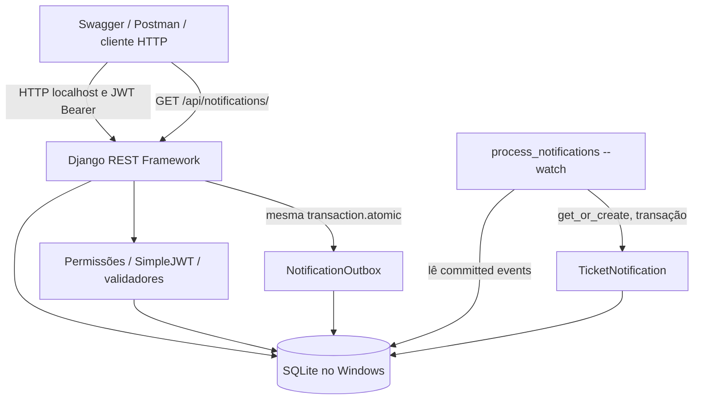
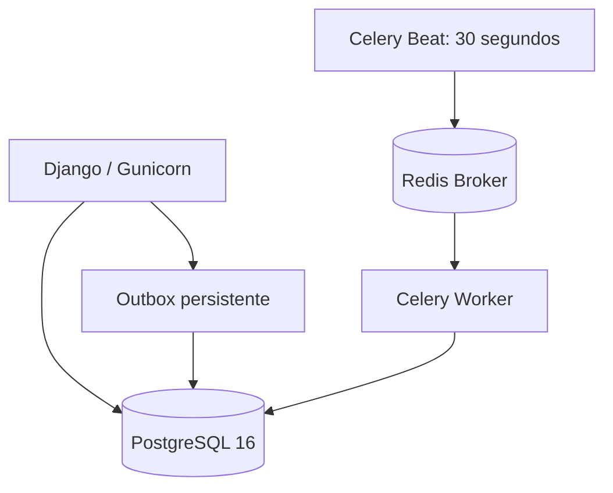

# Arquitetura — Chamados API v1.0.0-local.1

## Visão geral (o que existe e o que foi executado)

O fluxo **Local Demo** usa `runserver 127.0.0.1:8000` e `SQLite`; o
processador independente executa o comando Django `process_notifications`
na segunda janela. HTTP não precisa chamar Redis para gravar chamados nem
para registrar intenções de notificação. A outbox é escrita na mesma
transação do ticket/comentário; ao confirmar o commit, outro processo
pode consumir eventos. Um evento processado gera uma notificação privada
por destinatário. O acesso à inbox filtra por `request.user`.

## Ambiente alternativo validado em CI, não implantado em produção

O Docker Compose com Redis, worker e PostgreSQL é testado em GitHub
Actions com criação real de notificação. A configuração Railway IaC
é **preparação**, não evidência de serviços contratados, deploy HTTPS ou
backups em produção. O usuário não autorizou recursos pagos.

## Invariantes de domínio e privacidade

- Solicitantes veem somente chamados autorizados; equipe `is_staff`
  pode gerenciar a fila. Alterações de status passam por uma máquina
  explícita de transições.
- Notas internas nunca são propagadas para a caixa de entrada do
  solicitante. Notificações exibem somente `kind`, referência e data.
- Escrita do evento outbox é atômica com escrita de domínio; falha antes
  do commit não publica notificações órfãs.
- `TicketNotification.source` tem unicidade no banco, tornando segura
  a repetição do processamento da inbox.
- O consumidor local **exige DEBUG=True** e só é apropriado para
  localhost/demonstração. Não rodar múltiplos processadores nem acoplá-lo
  a uma instância Celery para o mesmo banco.
- JWT expira; `refresh` pode ser revogado na blacklist. Não armazenar
  JWT/senha em arquivos do repositório, prints ou tickets do GitHub.

## Operação e observabilidade

- Rotas públicas `/api/health/live/`, `/api/health/ready/` e Swagger.
- Logs JSON estruturados, request ID e métricas de baseline do ORM.
- CI em Python 3.10/3.11/3.12 + SQLite e PostgreSQL 16; smoke do
  Docker Compose real e typecheck da configuração Railway IaC.
- Backups **locais** ficam fora do Git (`data/`). Não existe backup
  ou restauração de produção comprovados.

## Escopo deliberado

**Incluído:** autenticação JWT, CRUD de chamados, permissões, comentários,
histórico auditável, notificações internas, outbox, testes e Swagger.

**Não incluído:** frontend personalizado, e-mail/push, domínio público,
hosting 24x7, TLS de produção, banco gerenciado ou SLA de disponibilidade.
A [CHM-601](https://github.com/ZaraTakion/chamados-api/issues/15)
permanece aberta apenas para esse escopo de hospedagem. Este documento
não transforma validação de CI em evidência de implantação pública.
